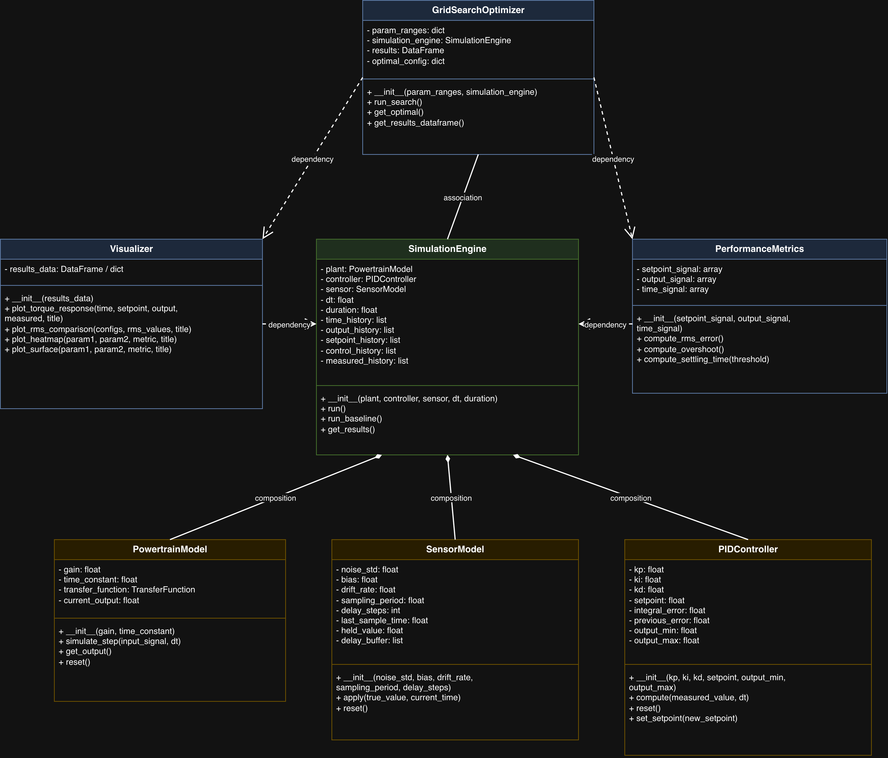
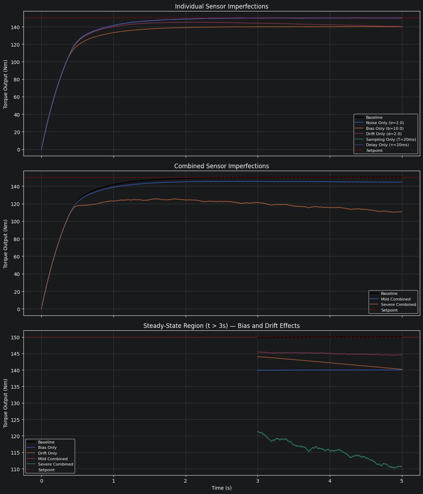
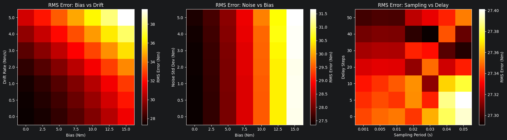

# CFMOSCPTCS - A Computational Framework for Modeling and Optimization of Sensor-Constrained Powertrain Torque Control Systems


[](https://doi.org/10.5281/zenodo.20090359)

---

## Overview

Real sensors are never perfect. Every torque sensor, position sensor, and temperature sensor in a production vehicle introduces some combination of measurement noise, bias, drift, sampling rate limitations, and signal delay. These imperfections degrade the controller's ability to regulate powertrain torque accurately, and in real systems, they do not occur in isolation. They stack on top of each other.

This project provides a computational simulation framework that models a simplified powertrain torque control system, injects five types of realistic sensor imperfections into the feedback loop, measures the resulting performance degradation, and uses grid search optimization to identify which sensor configurations deliver the best balance between quality and control accuracy. The framework evaluated 16,807 sensor configurations and found that **bias and drift are the dominant degradation factors**, while noise, sampling rate, and delay had negligible individual impact at the magnitudes tested.

This is the senior design project for CSC492-02 at California State University, Dominguez Hills (Spring 2026).

---

## Key Contributions

- **Integrated sensor imperfection modeling** - Five imperfection types (noise, bias, drift, sampling rate, delay) applied simultaneously within a single closed-loop simulation, addressing a gap in existing literature where these are typically studied in isolation.
- **Quantified performance degradation** - Measurable metrics (RMS torque error, overshoot, settling time) that show exactly how each imperfection affects control performance individually and in combination.
- **Full parameter space optimization** - Grid search across 16,807 configurations producing heatmaps and visualizations that map sensor quality to control performance.
- **Practical engineering insight** - Results demonstrate that resources spent reducing noise floors, increasing sampling rates, or minimizing signal delay yield little return if bias and drift are not addressed first.

---

## Architecture

The framework follows a four-stage pipeline:

1. **Model** - A first-order powertrain transfer function T(s) = K / (τs + 1) with an IMC-tuned PI controller.
2. **Inject** - Five sensor imperfections applied sequentially to the feedback signal via the SensorModel class.
3. **Measure** - RMS torque error, overshoot, and settling time computed for each simulation run.
4. **Optimize** - Grid search across all parameter combinations to identify optimal sensor configurations.

Seven classes implement this pipeline: `PowertrainModel`, `PIDController`, `SensorModel`, `SimulationEngine`, `PerformanceMetrics`, `GridSearchOptimizer`, and `Visualizer`. The class relationship diagram and all sequence diagrams are available in the [`architecture-diagrams/`](architecture-diagrams/) directory.



---

## Repository Structure

```
cfmoscptcs/
├── src/
│   └── cfmoscptcs_framework.ipynb                  # Complete framework (7 classes, verification, experiments, optimization)
│
├── architecture-diagrams/                           # UML design diagrams
│   ├── use-case-diagram.png
│   ├── seq-diagram-baseline.png
│   ├── seq-diagram-degraded.png
│   ├── seq-diagram-grid-search-optimization.png
│   ├── seq-diagram-visualizer-analyzer.png
│   └── class-relationship-diagram.png
│
├── results/                                         # Experimental outputs and verification artifacts
│   ├── imc_tuning_verification.png
│   ├── imc_tuning_verification.txt
│   ├── degraded_torque_comparison.png
│   ├── rms_error_configurations.png
│   ├── rms_error_heatmaps.png
│   ├── rms_error_surface.png
│   ├── experimental_simulation_configurations.txt
│   └── unit-level-verification/                     # Per-class verification outputs
│       ├── powertrain-model/
│       ├── pid-controller/
│       ├── sensor-model/
│       ├── simulation-engine/
│       ├── performance-metrics/
│       ├── grid-search-optimizer/
│       └── visualizer/
│
├── requirements.txt                                 # Python dependencies
├── LICENSE
├── README.md
├── CITATION.cff
├── CONTRIBUTING.md
├── SECURITY.md
├── CODE_OF_CONDUCT.md
└── .gitignore
```

---

## Getting Started

### Prerequisites

- Python 3.10 or higher
- pip (Python package manager)
- Jupyter Notebook support (via PyCharm, VS Code, JupyterLab, or the classic Jupyter interface)

### Installation

1. Clone the repository:
   ```bash
   git clone https://github.com/avishekb798/cfmoscptcs.git
   cd cfmoscptcs
   ```

2. Create and activate a virtual environment:
   ```bash
   python3 -m venv .venv
   source .venv/bin/activate
   ```

3. Install dependencies:
   ```bash
   pip install -r requirements.txt
   ```

4. Open the notebook:
   ```bash
   jupyter notebook src/cfmoscptcs_framework.ipynb
   ```

### Dependencies

| Library | Version | Purpose |
|---------|---------|---------|
| NumPy | 2.4.4 | Array operations, random number generation |
| SciPy | 1.17.1 | Signal processing utilities |
| matplotlib | 3.10.9 | Plotting and visualization |
| pandas | 3.0.2 | Grid search results as structured DataFrames |
| python-control | 0.10.2 | Transfer function construction and verification |

---

## Usage

The notebook is organized into sequentially numbered sections. Run all cells from top to bottom to reproduce the full pipeline.

**Sections 1–7** implement and individually verify each of the seven classes.

**Section 8** tunes the PID controller using IMC and verifies the closed-loop step response.

**Section 9** runs degraded simulations with individual and combined sensor imperfections, producing torque response plots and RMS error comparisons.

**Section 10** executes the full grid search optimization across 16,807 configurations.

**Section 11** generates heatmaps and visualizations of the optimization results.

To run a quick subset, execute Sections 1–7 (class definitions) and then jump to any experiment section. The grid search in Section 10 takes approximately 5–10 minutes depending on hardware.

---

## Methodology

The framework uses a first-order linear transfer function (K = 200 Nm, τ = 0.5 s) as the powertrain model, with PID gains tuned via Internal Model Control (λ = 0.1 s). Five sensor imperfections are modeled mathematically:

| Imperfection | Model | Parameter |
|---|---|---|
| Measurement Noise | y(t) = x(t) + w(t), w ~ N(0, σ²) | σ (noise std. dev.) |
| Bias | y(t) = x(t) + b | b (offset value) |
| Drift | y(t) = x(t) + d·t | d (drift rate) |
| Sampling Rate | y(kT) = x(kT), held between samples | T (sampling period) |
| Signal Delay | y(t) = x(t − τ_d) | τ_d (delay duration) |

Grid search sweeps seven values for each of the five parameters (7⁵ = 16,807 total configurations), scoring each by RMS torque error. Full methodology details are in the final report.

---

## Results

**Baseline performance:** 150 Nm setpoint reached with zero overshoot, 1.51 s settling time, and 27.34 Nm RMS error (transient-dominated).

**Key findings:**

- **Bias and drift** are the dominant degradation factors. A 10 Nm bias produced a persistent steady-state offset. A drift rate of 2.0 Nm/s caused progressive divergence from the setpoint.
- **Noise, sampling rate, and delay** produced negligible visible deviation from baseline at tested magnitudes.
- **Combined severe imperfections** (noise = 5.0, bias = 15.0, drift = 5.0, sampling = 50 ms, delay = 50 steps) pushed RMS error to 39.92 Nm, a **46% increase** over baseline.
- **Grid search** confirmed that all top-performing configurations share bias = 0 and drift = 0, regardless of other parameter values.

| | |
|---|---|
|  |  |

---

## Technologies Used

- **Python 3.12** - Primary language
- **Jupyter Notebook** - Development and execution environment
- **NumPy** - Numerical computation
- **SciPy** - Signal processing
- **matplotlib** - Visualization (torque plots, bar charts, heatmaps, surface plots)
- **pandas** - Structured data handling for grid search results
- **python-control** - Transfer function construction and step response verification
- **draw.io** - Architecture and UML diagrams
- **PyCharm** - IDE
- **Git / GitHub** - Version control and repository hosting

---

## Author

**Avishek Barua**

---

## License

This project is licensed under the MIT License. See [`LICENSE`](LICENSE) for details.
